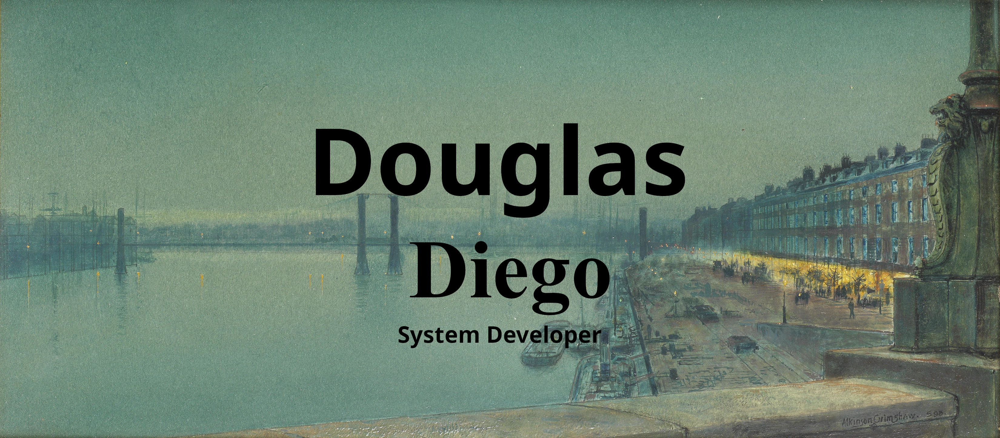

 

## Sobre mim

📓 Cursando Desenvolvimento de Sistemas (curso técnico).
 
💡Estou estudando C#, Java, JavaScript, PHP,Banco de Dados, sempre em busca de novos aprendizados para expandir minhas habilidades técnicas.
  

## Hard Skills

  
  
    

 
 

### Sistemas Operacionais

	
    	

## 📊 Minhas Estatísticas

   
  

## Contatos

 

